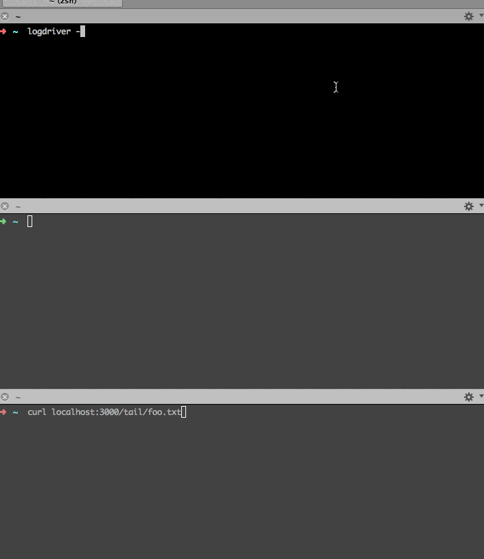

Logdriver
=========

.. image:: https://upload.wikimedia.org/wikipedia/commons/thumb/5/55/Loggers_klaralven.jpg/800px-Loggers_klaralven.jpg
    :target: https://en.wikipedia.org/wiki/Log_driving
    :alt: Log Driving

Logdriver makes ephemeral logs available downstream as an HTTP Event Source resource.

.. image:: https://travis-ci.org/smn/logdriver.svg?branch=develop
    :target: https://travis-ci.org/smn/logdriver
    :alt: Continuous Integration

.. image:: https://coveralls.io/repos/smn/logdriver/badge.png?branch=develop
    :target: https://coveralls.io/r/smn/logdriver
    :alt: Code Coverage

.. image:: https://readthedocs.org/projects/logdriver/badge/?version=latest
    :target: https://logdriver.readthedocs.org
    :alt: Logdriver Documentation

Usage
~~~~~

::

    $ logdriver -h
    Usage of ./logdriver:
      -a="0.0.0.0:3000":  (shorthand for -address)
      -address="0.0.0.0:3000": The address to bind to.
      -d="":  (shorthand for -directory)
      -directory="": The directory to tail log files from.

.. _Mesos: http://mesos.apache.org
